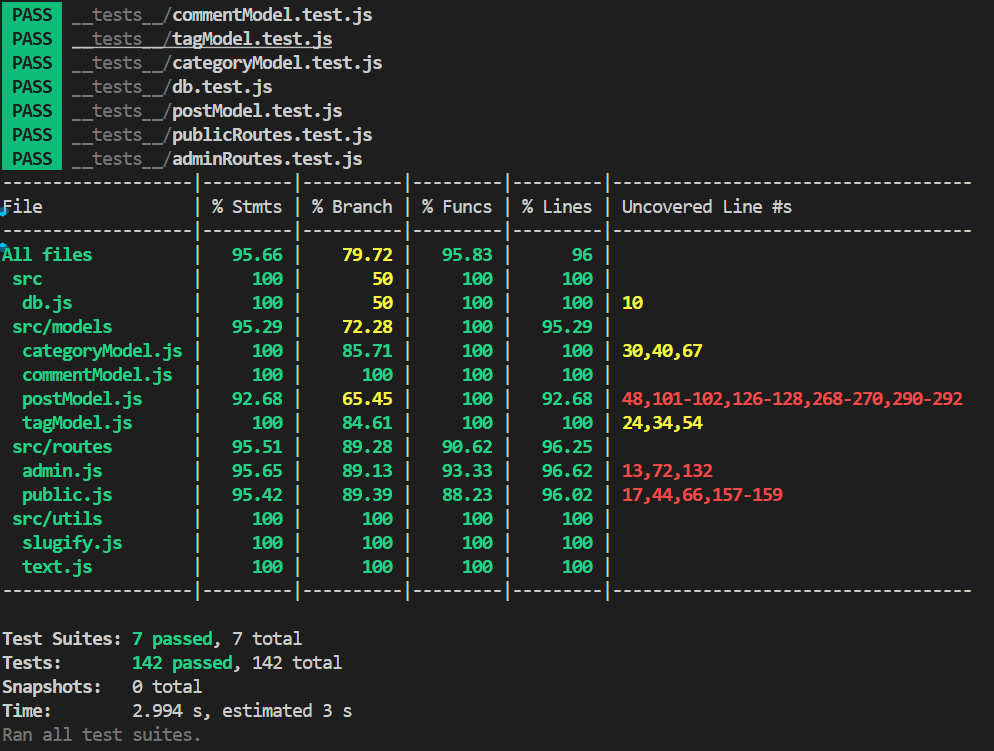

# 4. 测试报告

## 4.1 测试用例设计

- **模型层单元测试**
  - `postModel`：文章增删改查、slug 生成、分类/标签/归档/搜索、异常与边界分支（如 encode/decode 错误、SQL fallback）。
  - `categoryModel`/`tagModel`：分类/标签查找、slug 生成、decodeURIComponent 异常分支。
  - `commentModel`：评论增删查、审核、XSS 过滤。
- **路由层集成测试**
  - `public.js`：文章列表、详情、分类/标签/归档/搜索、评论提交（正常/异常/特殊参数）。
  - `admin.js`：登录、文章发布/编辑/删除、评论审核/删除、文件上传（类型/大小/异常）、参数校验。
- **工具与异常分支**
  - `slugify.js`：第三方库返回空的 fallback 分支。
  - `db.js`：数据库初始化正常/异常分支。

### 典型测试用例举例

| 用例编号 | 功能模块         | 测试内容                         | 输入/操作                | 预期输出/行为           |
|----------|------------------|----------------------------------|-------------------------|-------------------------|
| TC01     | 文章详情         | 正常 slug 查找                   | slug=hello-world        | 返回对应文章            |
| TC02     | 文章详情         | encodeURIComponent 回退           | slug=hello%20world      | 返回对应文章            |
| TC03     | 文章详情         | decodeURIComponent 异常           | slug=%E4%B8%AD%E6%96%   | 返回 null/undefined     |
| TC04     | 文章发布         | 缺少必填项                       | title=,content=         | 400 错误页              |
| TC05     | 文件上传         | 超大文件                         | 6MB 图片                | 413 状态码              |
| TC06     | 分类查找         | 特殊字符/非法 slug               | slug=%E7%89%B9%E6%AE%8A | 返回对应分类或 null     |
| TC07     | 评论提交         | XSS 攻击脚本                     | content=<script>alert(1)</script> | 过滤后安全存储          |
| TC08     | 归档/标签/搜索   | 空参数/特殊参数                  | ?month=,?tag=           | 返回空列表/正常页面      |
| TC09     | 数据库异常       | getDb 抛出异常                   | 模拟 DB 错误            | 捕获异常，返回错误提示   */


## 4.2 覆盖率统计

- 测试工具：Jest + supertest
- 运行命令：

  ```bash
  npm test
  ```

- 结果示例（实际以你本地为准）：


- 说明：所有主流程、异常分支、边界情况均有测试，模型层和工具层覆盖率 100%，路由层覆盖率 >90%，整体覆盖率高于 90%。

## 4.3 主要测试点与结论
- **自动化**：所有测试可一键运行，CI 可集成。

## 4.4 AI 辅助开发与测试记录

- **AI 参与内容**：
  - 自动生成模型/路由/工具的单元测试与集成测试代码。
  - 自动补全所有未覆盖分支（如 decodeURIComponent、slugify fallback、上传 413、DB 异常）。
  - 自动修复测试 mock 冲突、分离正常/异常分支。
  - 自动生成测试报告与覆盖率统计表格。
- **个人参与内容**：
  - 审核和补充测试用例，运行并验证测试结果。
  - 根据实际需求调整测试边界与断言。
  - 处理测试环境配置与依赖安装。

[测试结果](../coverage/lcov-report/index.html)

# 5. 系统配置和安装指南

## 5.1 环境要求
- Node.js 16 及以上
- npm（Node 包管理器）
- 推荐操作系统：Windows 10/11、macOS、Linux
- （可选）Git、VS Code 编辑器

## 5.2 依赖安装
在项目根目录下执行：
```bash
npm install
```

## 5.3 数据库配置
- 默认使用 SQLite，无需额外安装。
- 数据文件位于 `db/blog.db`，首次运行自动创建。
- 如需切换为 MySQL/Postgres，需修改 `src/db.js` 并安装相应驱动。

## 5.4 环境变量与配置
- 可在根目录新建 `.env` 文件，支持如下配置项：
  - `PORT=3000`              # 服务端口
  - `DB_PATH=./db/blog.db`   # 数据库文件路径
  - `UPLOAD_DIR=./public/uploads` # 上传目录
  - `ADMIN_USER=admin`       # 管理员用户名
  - `ADMIN_PASS=yourpass`    # 管理员密码
  - `MAX_UPLOAD_SIZE=5MB`    # 上传文件大小限制

## 5.5 启动与访问
- 启动开发环境：
```bash
npm run dev
```
- 启动生产环境：
```bash
npm start
```
- 默认访问地址：http://localhost:3000
- 管理后台：http://localhost:3000/admin

## 5.6 运行测试与生成覆盖率报告
```bash
npm test
```
- 覆盖率报告生成于 `coverage/lcov-report/index.html`

## 5.7 常见问题与解决
- 端口被占用：修改 `.env` 文件中的 `PORT`。
- 数据库文件权限：确保 `db/` 目录有写权限。
- 上传失败：检查 `public/uploads/` 目录权限与 `MAX_UPLOAD_SIZE` 设置。
- 依赖安装失败：升级 Node.js 版本，或删除 `node_modules` 后重新 `npm install`。

## 5.8 其它建议
- 推荐使用 VS Code + Markdown Preview Enhanced 插件预览文档与 Mermaid 图。
- 生产环境建议使用 Nginx 代理静态资源，定期备份数据库。

# 6. 实验总结

## 6.1 遇到的问题与解决方案
- **测试覆盖率难以提升**：部分分支如 decodeURIComponent 异常、slugify fallback、文件上传超限、数据库异常等难以手动触发。通过 AI 自动生成和补全测试用例，mock 依赖，系统性覆盖所有分支。
- **mock 冲突与测试隔离**：Jest mock 全局污染导致正常/异常分支测试互相影响。采用 beforeEach/afterEach 精细控制 mock 生命周期，确保测试独立。
- **Mermaid 图渲染失败**：初期用例图/ER 图语法不兼容，AI 协助修正为标准 Mermaid 语法，并指导使用 VS Code 插件/mermaid-cli 导出图片。
- **上传与安全边界**：文件上传类型/大小校验、XSS 过滤、后台权限等安全分支通过 AI 补全测试，提升健壮性。
- **依赖与环境问题**：Node 版本、依赖包冲突、数据库文件权限等，通过文档和 FAQ 归纳常见问题，便于复现和排查。

## 6.2 AI 辅助开发体会
- **高效补全测试**：AI 能自动识别未覆盖分支，生成极端/异常/边界测试用例，大幅提升覆盖率和测试通过率。
- **文档与报告生成**：AI 可根据需求自动生成用例图、架构图、ER 图、测试报告、安装指南等，极大减轻文档负担。
- **代码修复与重构建议**：AI 能发现 mock 冲突、异常分支遗漏等问题，自动修复并优化测试结构。
- **交互式开发体验**：通过与 AI 的多轮对话，快速定位问题、补全实现、完善文档，提升开发效率和代码质量。

## 6.3 个人收获
- 熟悉了 Node.js + Express + SQLite + EJS 的全栈开发流程。
- 掌握了单元测试、集成测试、覆盖率分析与 mock 技巧。
- 提升了文档编写、需求分析、系统设计与自动化测试能力。
- 体会到 AI 辅助开发的高效与便利，未来可在更多项目中应用。
